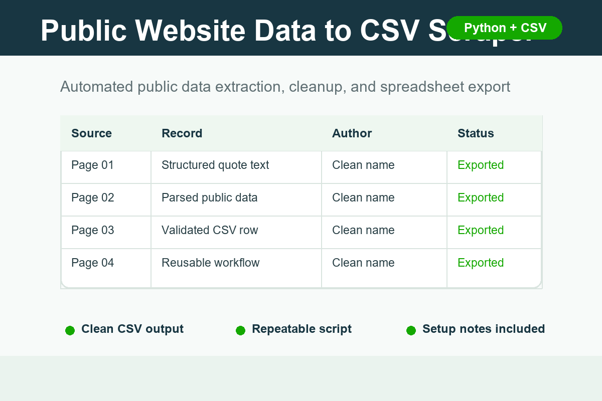

# Automation Portfolio Samples

Small, practical work samples for Upwork clients who need Python automation,
public web data extraction, CSV cleanup, and AI-assisted workflow design.

## Portfolio Preview

## Samples

### 1. Public Website Data to CSV Scraper

Folder: `public-site-to-csv-scraper`

Demonstrates a lightweight Python script that collects public webpage records,
parses fields, and exports clean rows to CSV.

Best-fit client projects:

- scrape public website data into CSV or Excel
- clean repeated webpage records into a structured spreadsheet
- build a repeatable script with clear setup notes

### 2. AI Email Triage Workflow

Folder: `ai-email-triage-workflow`

Shows how an inbox workflow can classify messages into action buckets and
produce a daily summary without sending anything automatically.

Best-fit client projects:

- summarize inbox or support messages
- classify leads, urgent messages, invoices, and low-priority emails
- create safe draft replies that still require human approval

### 3. Excel to Gmail Draft Automation

Folder: `excel-gmail-draft-automation`

Shows a safe spreadsheet-to-email workflow that creates reviewable Gmail draft
records from CSV rows without sending messages automatically.

Best-fit client projects:

- process Excel or CSV reports into personalized Gmail drafts
- create reviewable notification workflows
- keep human approval before any email is sent

### 4. Automated Job Scraper

Folder: `automated-job-scraper`

Demonstrates a small job-listing parser that extracts structured records from
public-style HTML, filters by project fit and pay, and exports clean CSV rows.

Best-fit client projects:

- scrape public job or listing pages into CSV
- filter records by keywords, location, budget, or tags
- build a first milestone before adding scheduling or alerts

## Service Scope

I prefer small, clear projects where the result is measurable:

- a CSV, Excel, or JSON output file
- a working Python script
- a documented API or automation workflow
- a simple internal tool or reviewable AI workflow

## Client-Friendly Delivery

For paid projects, I normally deliver:

- source code or workflow steps
- output files
- short setup notes
- clear assumptions and limitations
- a small test sample before completing the full run when possible

## License

MIT License. See `LICENSE`.
